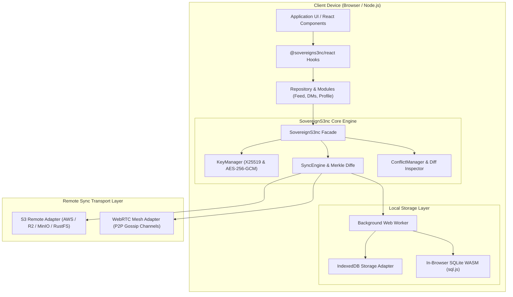
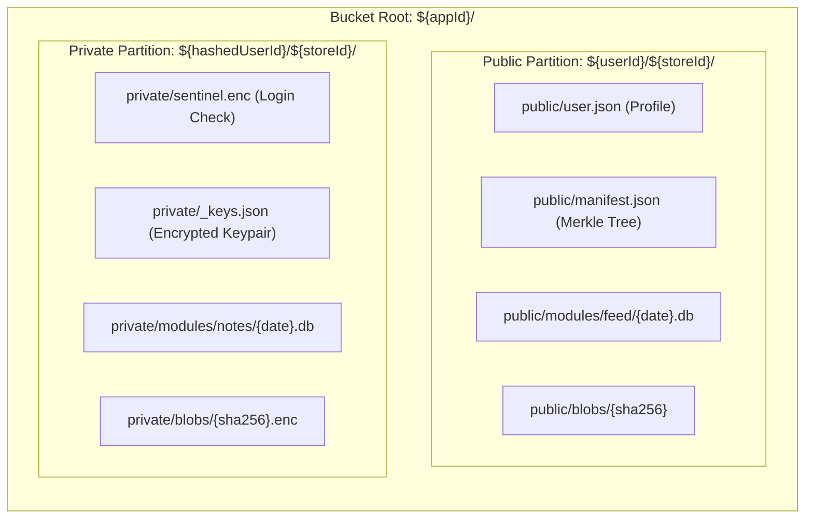
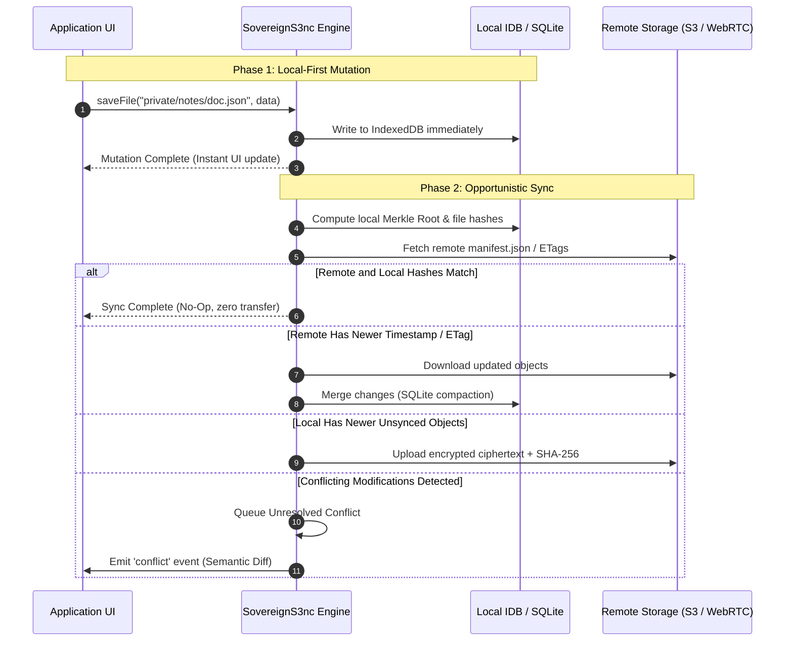

# Architecture & System Internals

SovereignS3nc is engineered from the ground up as a **zero-trust, offline-first data synchronization engine**. This document details the system design, cryptographic isolation model, and data flow pipelines.

---

## 🏛️ High-Level System Architecture

---

## 🔒 Storage Partitioning & Security Isolation

To prevent third parties or malicious S3 bucket administrators from mapping data back to human identities, SovereignS3nc separates public and private data partitions using deterministic hashing.

### Salted Hash Formula
The private partition key is derived as:
$$\text{hashedUserId} = \text{SHA-256}(\text{userId} + \text{appId} + \text{salt/serverSecret})$$

Without the master password or server secret, an attacker viewing the S3 bucket cannot correlate private records with the public profile.

---

## 🔄 Two-Way Synchronization Pipeline

Synchronization is executed asynchronously inside a dedicated Web Worker to avoid blocking UI rendering.

---

## 🌲 Hierarchical Merkle Tree Diffing

When accounts store hundreds of daily SQLite databases or media attachments, fetching metadata for every remote key is slow and costly.

SovereignS3nc generates a hierarchical Merkle tree embedded in `public/manifest.json`:
1. Each file has a SHA-256 hash and ISO timestamp.
2. Directories and modules aggregate child hashes into node hashes.
3. The root hash represents the entire account state.

During synchronization, SovereignS3nc compares the top-level Merkle root first. If the root matches, the sync finishes in **a single HTTP roundtrip**. If hashes differ, it traverses only the affected subtree branches.

---

## 🌐 WebRTC Peer-to-Peer Mesh Gossip

In addition to S3 object storage, SovereignS3nc provides the `WebRTCRemoteAdapter`:
- Peers maintain direct `RTCDataChannel` connections.
- Multiple browser tabs communicate via `BroadcastChannel`.
- File writes trigger compact gossip state announcements containing file paths, hashes, and version vectors.
- Peers that fall behind request missing chunks directly over the peer mesh without hitting any central server.
